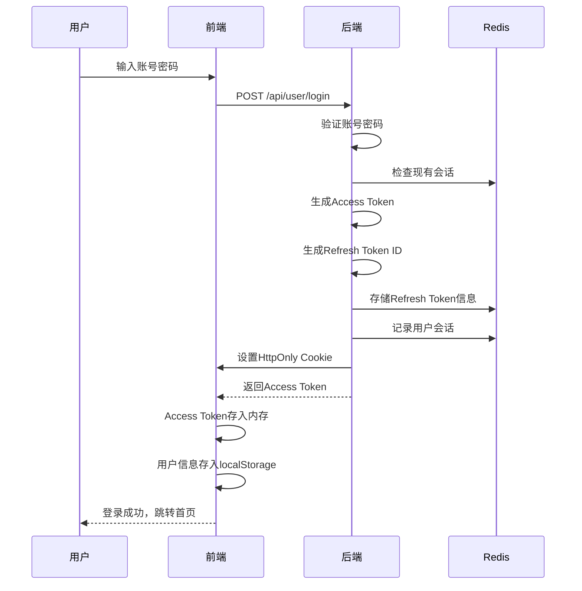
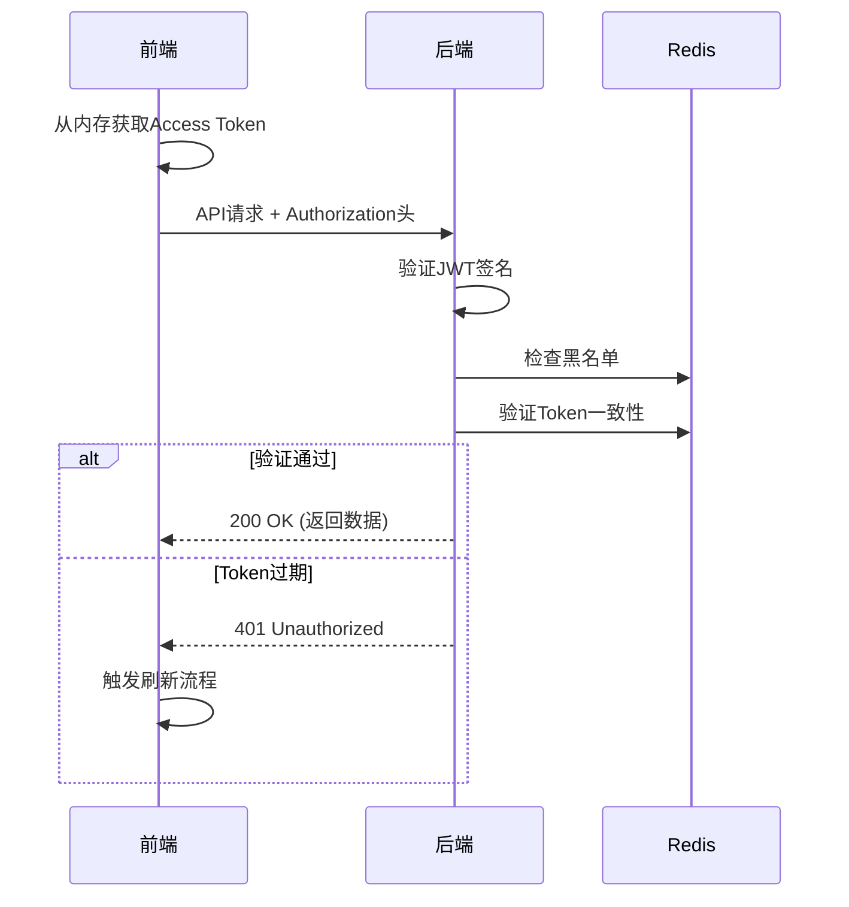
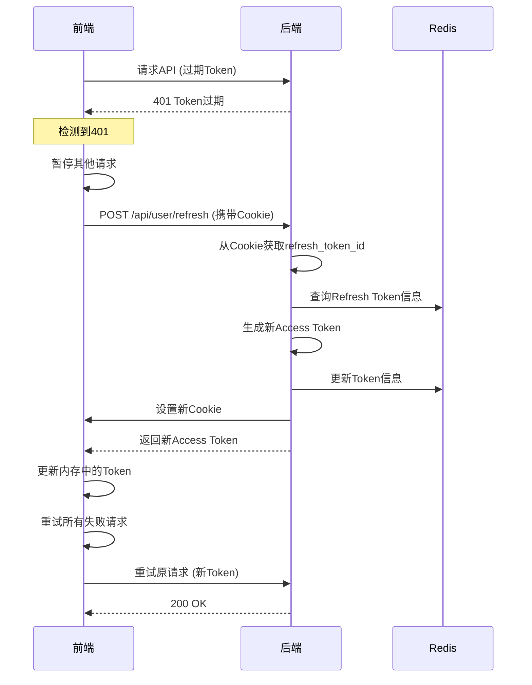
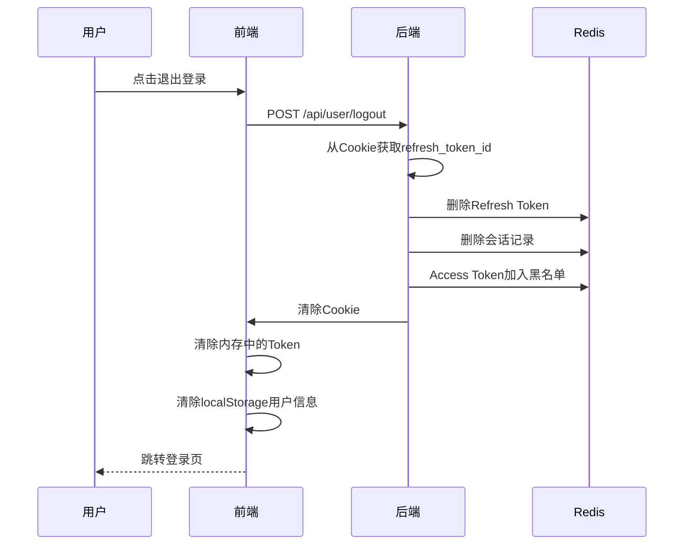

# front-end

This template should help get you started developing with Vue 3 in Vite.

## Recommended IDE Setup

[VS Code](https://code.visualstudio.com/) + [Vue (Official)](https://marketplace.visualstudio.com/items?itemName=Vue.volar) (and disable Vetur).

## Recommended Browser Setup

- Chromium-based browsers (Chrome, Edge, Brave, etc.):
  - [Vue.js devtools](https://chromewebstore.google.com/detail/vuejs-devtools/nhdogjmejiglipccpnnnanhbledajbpd)
  - [Turn on Custom Object Formatter in Chrome DevTools](http://bit.ly/object-formatters)
- Firefox:
  - [Vue.js devtools](https://addons.mozilla.org/en-US/firefox/addon/vue-js-devtools/)
  - [Turn on Custom Object Formatter in Firefox DevTools](https://fxdx.dev/firefox-devtools-custom-object-formatters/)

## Customize configuration

See [Vite Configuration Reference](https://vite.dev/config/).

## Project Setup

```sh
npm install
```

### Compile and Hot-Reload for Development

```sh
npm run dev
```

### Compile and Minify for Production

```sh
npm run build
```

### Lint with [ESLint](https://eslint.org/)

```sh
npm run lint
```
# 基于Cookie+Redis的Token认证系统设计方案

## 文档信息
| 文档版本 | 修改日期 | 修改人 | 修改内容 |
|---------|---------|--------|---------|
| V1.0 | 2026-02-13 | 总会落叶 | 初始版本创建 |

---

## 一、方案概述

### 1.1 背景
传统的Token存储方式（localStorage/sessionStorage）存在XSS攻击风险，纯Cookie存储无法主动控制Token生命周期。本方案采用**Cookie+Redis混合存储**，兼顾安全性和可控性。

### 1.2 设计目标
- ✅ **安全性**：防止XSS攻击，防止CSRF攻击
- ✅ **可控性**：支持主动失效、并发登录控制
- ✅ **体验性**：Token自动刷新，用户无感知
- ✅ **可扩展**：支持分布式部署，易于扩展

### 1.3 架构图
```
┌─────────────────┐      ┌──────────────────┐      ┌─────────────────┐
│     前端        │      │      后端        │      │     Redis       │
│                 │      │                  │      │                 │
│ 内存存储:       │      │ Cookie存储:      │      │ Key格式:        │
│ - Access Token  │─────▶│ - refresh_token_ │─────▶│ - refresh:{id}  │
│                 │      │   id (HttpOnly)  │      │ - user:token:{id}│
│ localStorage:   │◀─────│                  │      │ - blacklist:token│
│ - 用户信息      │      │ JWT生成:         │      │ - user:sessions  │
└─────────────────┘      │ - Access Token   │      └─────────────────┘
                         │ - 不返回Refresh   │
                         └──────────────────┘
```

---

## 二、核心存储设计

### 2.1 存储位置对比

| 存储类型 | 存储内容 | 特点 | 安全性 | 用途 |
|---------|---------|------|--------|------|
| **前端内存** | Access Token | 页面刷新即失 | ⭐⭐⭐⭐⭐ | API请求认证 |
| **HttpOnly Cookie** | Refresh Token ID | JS无法读取 | ⭐⭐⭐⭐⭐ | 刷新令牌 |
| **Redis** | Token详细信息 | 可主动失效 | ⭐⭐⭐⭐ | 状态管理 |
| **localStorage** | 用户信息(非敏感) | 持久存储 | ⭐⭐ | 界面显示 |

### 2.2 Redis Key设计

```yaml
# Refresh Token信息
Key: refresh:{refreshTokenId}
Value: {
  "tokenId": "uuid",
  "userId": 10001,
  "username": "张三",
  "deviceInfo": "Mozilla/5.0...",
  "ipAddress": "192.168.1.100",
  "loginTime": "2026-02-13 10:30:00",
  "lastRefreshTime": "2026-02-13 10:30:00",
  "refreshCount": 0,
  "isValid": true
}
TTL: 7天

# 用户当前Access Token
Key: user:token:{userId}
Value: "eyJhbGciOiJIUzI1NiIs..."
TTL: 15分钟

# 用户会话集合
Key: user:sessions:{userId}
Value: Set类型，包含所有refreshTokenId
TTL: 30天

# 黑名单
Key: blacklist:{accessToken}
Value: "blacklisted"
TTL: 剩余过期时间

# Token额外信息
Key: token:info:{accessToken}
Value: "device:iphone12,ip:192.168.1.100"
TTL: 15分钟
```

---

## 三、详细工作流程

### 3.1 登录流程



**代码示例：**
```java
// 登录核心代码
public LoginResultVO login(String account, String password, 
                          HttpServletResponse response) {
    // 1. 验证用户
    User user = userService.login(account, password);
    
    // 2. 生成Access Token
    String accessToken = jwtUtil.generateAccessToken(user);
    
    // 3. 生成Refresh Token ID
    String refreshTokenId = UUID.randomUUID().toString();
    
    // 4. 存入Redis
    RefreshTokenInfo info = RefreshTokenInfo.builder()
            .tokenId(refreshTokenId)
            .userId(user.getId())
            .username(user.getUsername())
            .loginTime(new Date())
            .build();
    redisUtil.storeRefreshToken(refreshTokenId, info, 604800);
    
    // 5. 设置HttpOnly Cookie
    Cookie cookie = new Cookie("refresh_token_id", refreshTokenId);
    cookie.setHttpOnly(true);
    cookie.setSecure(true);
    cookie.setPath("/api/user/refresh");
    cookie.setMaxAge(604800);
    response.addCookie(cookie);
    
    // 6. 返回Access Token
    return LoginResultVO.builder()
            .accessToken(accessToken)
            .expiresIn(900)
            .build();
}
```

### 3.2 请求认证流程



### 3.3 Token刷新流程



**前端刷新核心代码：**
```javascript
// axios响应拦截器
axios.interceptors.response.use(
  response => response,
  async error => {
    if (error.response?.status === 401 && !error.config._retry) {
      error.config._retry = true;
      
      try {
        // 调用刷新接口（自动携带Cookie）
        const res = await axios.post('/api/user/refresh', {}, {
          withCredentials: true
        });
        
        const newToken = res.data.data.accessToken;
        tokenManager.setAccessToken(newToken);
        
        // 重试原请求
        error.config.headers.Authorization = `Bearer ${newToken}`;
        return axios(error.config);
      } catch (refreshError) {
        // 刷新失败，跳转登录
        router.push('/login');
        return Promise.reject(refreshError);
      }
    }
    return Promise.reject(error);
  }
);
```

### 3.4 登出流程



---

## 四、安全设计

### 4.1 XSS防护
```yaml
1. Refresh Token ID存HttpOnly Cookie:
   - JS无法读取，彻底免疫XSS
   
2. Access Token存内存:
   - 页面刷新即失，攻击窗口小
   - 作用域限制，难以窃取
   
3. 输入过滤:
   - 所有用户输入进行转义
   - 富文本内容过滤
```

### 4.2 CSRF防护
```yaml
1. SameSite=Strict:
   - Cookie只在同站请求携带
   
2. 自定义Header:
   - 要求请求携带X-Requested-With头
   
3. 重要操作二次验证:
   - 修改密码需要原密码
   - 支付需要支付密码
```

### 4.3 主动失效机制
```yaml
1. 用户修改密码:
   - 删除该用户所有Refresh Token
   - 当前Access Token加入黑名单
   
2. 管理员踢人:
   - 删除指定设备的Refresh Token
   - 该设备下次请求被迫重新登录
   
3. 异常检测:
   - 设备变化检测
   - IP异常检测
   - 可触发安全告警
```

### 4.4 并发登录控制
```java
// 限制最多5台设备同时登录
public boolean checkAndLimitSessions(Long userId, String newTokenId) {
    String key = "user:sessions:" + userId;
    Long count = redis.opsForSet().size(key);
    
    if (count >= 5) {
        // 移除最旧的会话
        String oldest = redis.opsForSet().pop(key);
        redis.delete("refresh:" + oldest);
    }
    
    redis.opsForSet().add(key, newTokenId);
    return true;
}
```

---

## 五、性能优化

### 5.1 Redis优化
```yaml
1. Key设计:
   - 使用冒号分隔，便于管理
   - 设置合理的TTL，避免内存溢出
   
2. 批量操作:
   - 使用pipeline批量处理
   - 减少网络往返
   
3. 连接池:
   - 配置合理的连接池大小
   - 监控连接使用情况
```

### 5.2 前端优化
```yaml
1. 请求队列:
   - 刷新Token时暂停其他请求
   - 避免并发刷新
   
2. Token预刷新:
   - 在Token过期前5分钟主动刷新
   - 避免请求中断
   
3. 缓存策略:
   - 用户信息缓存
   - 权限数据缓存
```

---

## 六、异常处理

### 6.1 常见异常场景

| 异常场景 | 处理方式 | 返回码 | 用户提示 |
|---------|---------|--------|----------|
| Access Token过期 | 自动刷新 | 401 | 无感刷新 |
| Refresh Token过期 | 跳转登录 | 401 | 登录已过期 |
| Token不匹配 | 加入黑名单 | 401 | 账号在其他设备登录 |
| 设备变化 | 可选二次验证 | 401 | 设备变更验证 |
| 黑名单Token | 拒绝访问 | 401 | 请重新登录 |

### 6.2 错误响应格式
```json
{
  "code": 401,
  "message": "访问令牌无效或已过期",
  "data": null,
  "timestamp": 1707809400000
}
```

---

## 七、部署配置

### 7.1 后端配置
```yaml
# application.yml
jwt:
  secret: ${JWT_SECRET:your-secret-key}
  expiration: 900  # 15分钟
  refresh-expiration: 604800  # 7天
  issuer: luoye-mall

auth:
  max-sessions-per-user: 5  # 最大设备数
  enable-token-rotation: true  # 令牌轮换
  refresh-endpoint: /api/user/refresh  # 刷新接口

redis:
  host: ${REDIS_HOST:localhost}
  port: 6379
  password: ${REDIS_PASSWORD:}
  timeout: 5000
  lettuce:
    pool:
      max-active: 8
      max-idle: 8
      min-idle: 0
```

### 7.2 前端配置
```javascript
// .env.production
VITE_API_BASE_URL=https://api.luoye.com
VITE_COOKIE_DOMAIN=.luoye.com
VITE_COOKIE_SECURE=true
```

### 7.3 Nginx配置
```nginx
# 重要：确保Cookie正确传递
location /api/ {
    proxy_pass http://backend;
    proxy_set_header Host $host;
    proxy_set_header X-Real-IP $remote_addr;
    proxy_set_header X-Forwarded-For $proxy_add_x_forwarded_for;
    proxy_set_header X-Forwarded-Proto $scheme;
    
    # Cookie传递
    proxy_cookie_path / "/; HttpOnly; Secure; SameSite=Strict";
    
    # 允许跨域
    add_header Access-Control-Allow-Origin $http_origin;
    add_header Access-Control-Allow-Credentials true;
    add_header Access-Control-Allow-Methods 'GET, POST, PUT, DELETE, OPTIONS';
    add_header Access-Control-Allow-Headers 'DNT,X-Mx-ReqToken,Keep-Alive,User-Agent,X-Requested-With,If-Modified-Since,Cache-Control,Content-Type,Authorization';
}
```

---

## 八、监控与运维

### 8.1 监控指标
```yaml
1. Token相关:
   - 活跃Token数量
   - Token刷新频率
   - 黑名单大小
   
2. Redis监控:
   - 内存使用率
   - Key数量
   - 命中率
   
3. 安全监控:
   - 异常登录次数
   - 设备变化次数
   - 黑名单命中次数
```

### 8.2 日志记录
```java
@Slf4j
@Component
public class AuthLogger {
    
    public void logLogin(Long userId, String ip, String device) {
        log.info("用户登录 - userId: {}, ip: {}, device: {}", 
                 userId, ip, device);
    }
    
    public void logTokenRefresh(Long userId, String oldTokenId, String newTokenId) {
        log.info("令牌刷新 - userId: {}, oldToken: {}, newToken: {}", 
                 userId, oldTokenId, newTokenId);
    }
    
    public void logSecurityAlert(String type, String detail) {
        log.warn("安全告警 - type: {}, detail: {}", type, detail);
        // 发送告警邮件/短信
    }
}
```

---

## 九、常见问题解答

### Q1: Access Token为什么不存localStorage？
**A**: localStorage容易被XSS攻击窃取，存内存中页面刷新即失，攻击窗口小。

### Q2: Refresh Token ID存Cookie安全吗？
**A**: 安全。配合HttpOnly+Secure+SameSite=Strict，JS无法读取，防XSS防CSRF。

### Q3: 如何实现多设备登录控制？
**A**: 使用Redis的Set记录用户所有会话，超过限制时移除最早会话。

### Q4: 用户修改密码后如何处理？
**A**: 删除Redis中该用户所有Refresh Token，当前Access Token加入黑名单。

### Q5: 如何防止Token重放攻击？
**A**: 使用一次性Refresh Token轮换，每次刷新生成新的Refresh Token ID。

---

## 十、总结

本方案通过**Cookie+Redis混合存储**，实现了：
- ✅ **安全可靠**的认证机制
- ✅ **灵活可控**的Token管理
- ✅ **用户无感**的刷新体验
- ✅ **易于扩展**的系统架构

是目前企业级应用的最佳实践方案。